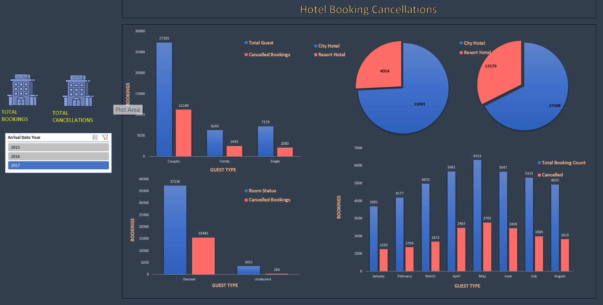

"# MS Excel Basics (As of Today)" 

Date:- 29/09/2025  
Tittle:- Build Dashboard on HOTEL BOOKING CANCELLATIONS Dataset downloaded from Kaggle 

# Dashboard Project

In this project, my main goal was not to build a very beautiful or advanced dashboard, but rather to **gain confidence** by creating one from scratch. While working on it, I faced several challenges such as deciding which columns to keep, which to remove, and how to design the dashboard step by step.

## What I Learned
- **Patience & Decision Making:** How to stay patient and make the right decisions at each step.  
- **Chart Selection:** How to choose the right type of chart, based on pivot charts.  
- **Slicers & Interactivity:** How to create and use slicers to make the dashboard more interactive.  
- **Design & Iteration:** How to design the layout and make improvements through iterations.  
- **Insight Extraction:** How to generate meaningful insights from charts and data.  
- **Calculated Columns & Formulas:** How to create new columns and apply the right formulas to support analysis.

---

> **Note:** I know this dashboard is quite simple and not very attractive in its current form. But I will keep improving step by step, refine my skills further, and build more advanced and visually appealing dashboards in the future.
