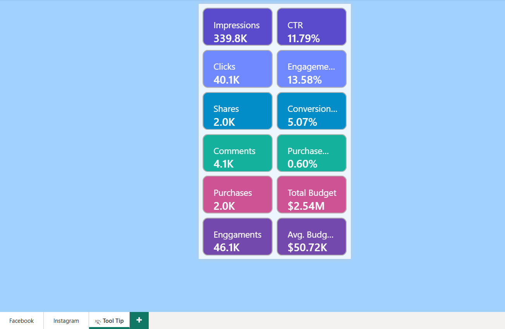

# 📊 Meta Ad Performance Dashboard (Power BI)

## 🧠 Project Overview
This project presents an **interactive Meta Ad Performance Dashboard** built in **Power BI** to analyze ad campaign performance across **Facebook and Instagram**.  
It enables marketing teams to monitor **key KPIs**, understand **audience behavior**, and optimize ad budgets with **data-driven insights**.

---

## 🎯 Objectives
- Track and visualize performance metrics of Meta ads (Facebook + Instagram)
- Identify engagement trends by **age, gender, country, and ad type**
- Evaluate **budget utilization** and **conversion funnel efficiency**
- Enhance interactivity through **dynamic slicers** and **tooltip drilldowns**

---

## ⚙️ Key Features
✅ **12+ KPIs Visualized**
- Impressions  
- Clicks  
- CTR (Click Through Rate)  
- Engagement Rate  
- Conversion Rate  
- Purchase Rate  
- Shares  
- Comments  
- Purchases  
- Engagements  
- Total Budget  
- Avg. Budget per Campaign  

✅ **Advanced Visuals**
- **Funnel chart** – Tracks the customer journey from impression to purchase  
- **Map visual** – Displays geographical reach and performance by country  
- **Age & Gender distribution** – Demographic segmentation  
- **Monthly calendar visual** – Time-based performance analysis  
- **Trend lines** – Weekly and hourly impression trends  
- **Heat matrix by Ad Type** – Performance comparison across Carousel, Image, Stories, and Video ads  

✅ **Interactive Filters / Slicers**
- Dynamic Measure Selector  
- Targeted Interest Selector  
- Campaign Name Filter  

✅ **Tooltips Concept**
- Implemented **custom tooltip pages** for detailed KPI insights  
- Hover-based micro dashboards (e.g., Impressions breakdown, CTR trend, Purchase funnel)

---

## 🧩 Tools & Technologies
- **Power BI Desktop**
- **Data Modeling with DAX**
- **Power Query for Data Cleaning & Transformation**
- **Custom Visuals (Maps, Funnel, Calendar, Donut, Bar, Line)**

---

## 🗂️ Dashboard Structure
### 🟦 Facebook Dashboard (Main)
- Overall campaign summary with demographic insights  
- Performance by age, gender, and country  
- Engagement and conversion trends  
- Ad-type performance matrix  

### 🟪 Instagram Dashboard (Sub Dashboard)
- Platform-specific insights (clicks, engagement, CTR)  
- Visual consistency with main dashboard  
- Tooltip drilldowns for micro-analysis  

---

## 📈 Insights Derived
- Engagement rate consistently above **13%** across campaigns  
- **Female demographic** contributes majority of impressions and engagement  
- CTR maintained around **11–12%**, with strongest performance from **video ads**  
- Budget utilization tracked effectively with **average $50K per campaign**  

---

## 📊 Data Model Summary
- **Fact Table:** Campaign Performance  
- **Dimension Tables:** Date, Platform, Country, Age Group, Ad Type, Campaign  
- Relationships established for easy filtering and KPI calculation using DAX measures  

---

## 📎 Key Learnings
- Implemented **Tooltips for the first time** to create contextual micro-insights  
- Strengthened understanding of **KPI creation using DAX**  
- Learned automation of visuals and consistency in **color themes & layouts**  
- Designed a **multi-page report** with clear navigation and interactivity  

---

## 🖼️ Dashboard Previews

### Facebook Dashboard (Main)
.png)

### Instagram Dashboard (Submain)
.png)

### Tooltip View

---

## 🚀 Future Enhancements
- Add **ROI analysis** and **Ad Spend Efficiency metrics**
- Integrate **real-time Meta API data refresh**
- Include **sentiment analysis** from comments (NLP-based)

---

**Tools:** Power BI | DAX | Power Query | Data Visualization  
**Purpose:** Marketing Analytics & Ad Campaign Optimization
